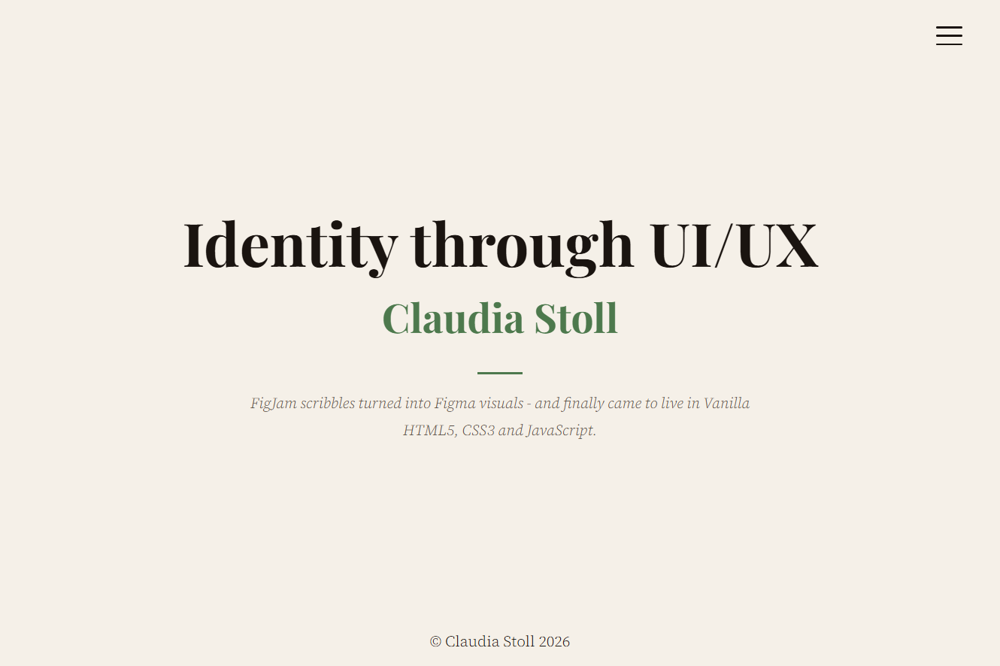
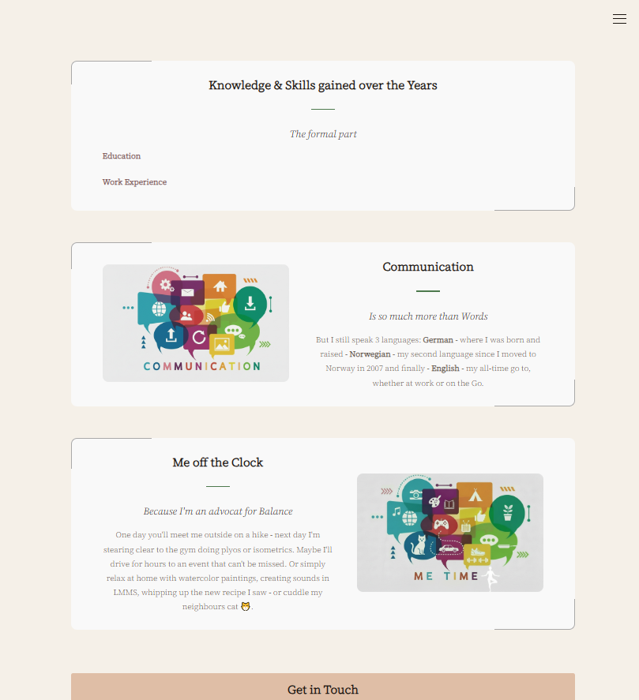
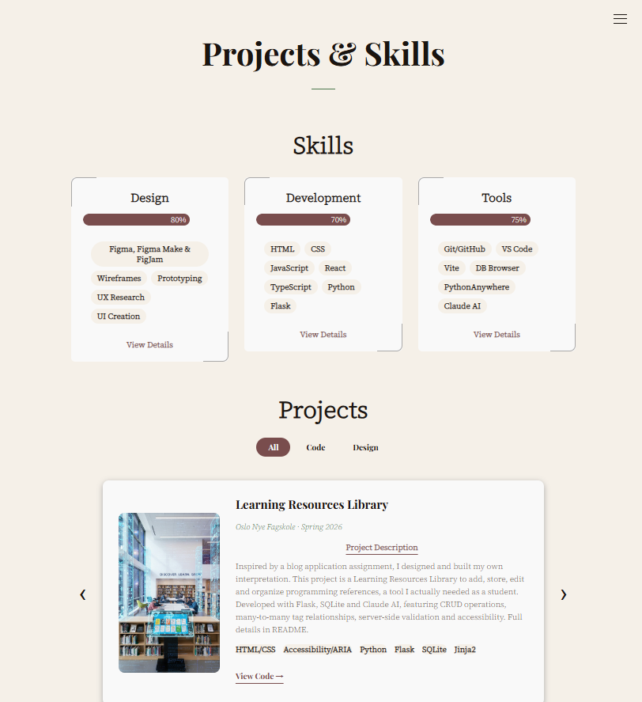

# Identity through UI/UX 🦄
### Portfolio – Claudia Stoll

The second iteration on my personal portfolio website – itself a portfolio piece. 
Built from scratch with Vanilla HTML, CSS and JavaScript.

## 🌐 Live Demo
[Visit My Portfolio](https://clauds2006.github.io/Portfolio-Claudia-Stoll-Identity-UIUX/)

## Screenshots

## Features
- Animated Hero with Typewriter Effect & Pause Control
- Web Components (Navigation & Footer)
- Personalized Cover Letter Page with URL Parameters
- Contact Form with Validation, Honeypot & Formspree
- Projects Gallery with Filter Tabs & Keyboard Navigation
- Skills Section with Level Indicators
- Responsive & Accessible Design (WCAG)
- Focus Trap in Navigation
- prefers-reduced-motion support

## Tech Stack
HTML · CSS · JavaScript · Web Components · Formspree

## Setup
This is a static website – no installation needed!

1. Clone the repository
git clone https://github.com/ClaudS2006/Portfolio-Claudia-Stoll-Identity-UIUX.git

2. Open with Live Server in VS Code
or simply open index.html in your browser

3. For cover letter page (future.html):
Add your employer data in js/future.js (not included in repo)

## Pages
- **Home** 
- **This is Me** – Animated Hero, About, Education, Work Experience & Contact
- **Projects & Skills** – Skills Overview & Projects Gallery
- **Cover Letter** – Personalized per Employer (future.html)

## Future Improvements
- Jest Unit Testing (planned)
- Multilingual Support (EN/NO/DE) (planned)

## Developed with
Claude AI · VS Code · GitHub Desktop · Figma

## License
MIT